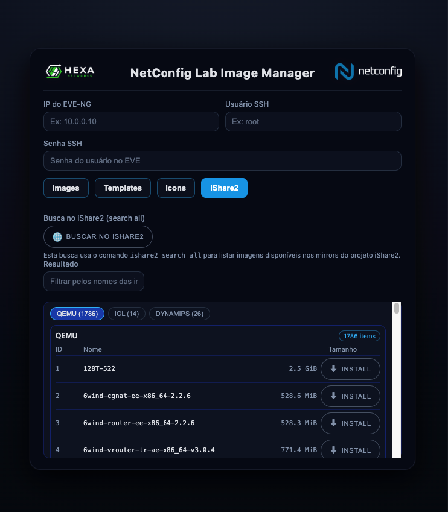

# NetConfig Lab Image Manager



Suporta tanto EVE-NG, quanto PNETLAB :)

## Features:

- Upload de imagens;
- Upload de templates .yaml;
- Upload de icones;
- Auto instalação de imagens no EVE-NG (iShare2 embarcado).

## Instalação do NetConfig Lab Image Manager

### 1. Instalar dependências

No Debian 12 ou 13:

```bash
apt-get update
apt-get install curl -y
curl -fsSL https://get.docker.com | sh
```

### 2. Clonar o repositório

```bash
git clone https://github.com/NetConfigAutomacao/netconfig-lab-image-manager.git /opt/netconfig-lab-image-manager
```

### 3. Iniciar o sistema

```bash
cd /opt/netconfig-lab-image-manager
docker compose up -d --build
```

### 4. Alterar porta (opcional)

Caso precise modificar a porta de acesso, edite o arquivo docker-compose.yml e ajuste o mapeamento de porta, por exemplo:

```bash
ports:
  - "80:8080"
```