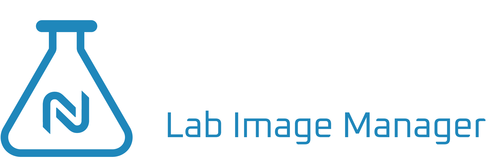
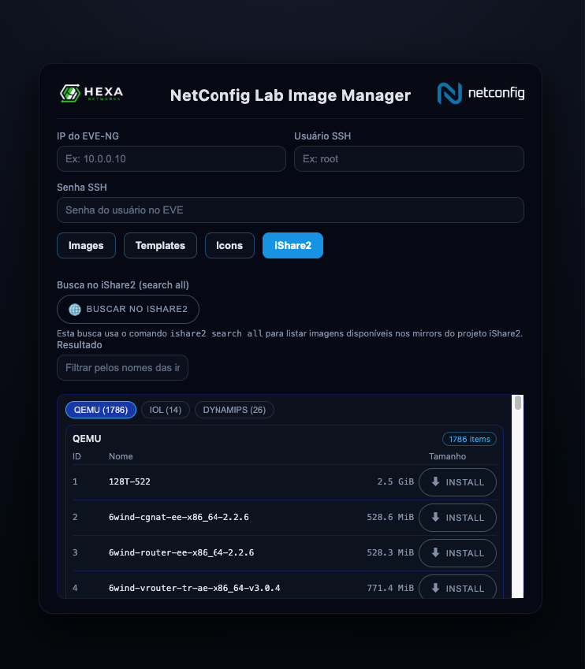

# NetConfig Lab Image Manager

Mini-índice: [Português](#pt) | [English](#en) | [Español](#es)

<a id="pt"></a>
## Português

### Sobre o projeto
Esse é um projeto OpenSource desenvolvido pela equipe do [NetConfig](https://netconfig.com.br/), software de automação de redes.
Quer saber mais sobre o NetConfig? Entre já e conheça!

O NetConfig - Lab Image Manager é um projeto que vem com a intenção de auxiliar aqueles que estudam redes, tirando a complexidade para subir imagens em laboratórios (EVE-NG / PNETLAB / ContainerLab) de forma que o usuário possa focar no seu estudo.

Não tente instalar direto no EVE/PNETLAB! A instalação é para ser em uma VM separada!

Suporta EVE-NG, PNETLAB e ContainerLab (em desenvolvimento) :)



### Funcionalidades

- Upload de imagens;
- Upload de templates .yaml;
- Upload de ícones;
- Auto instalação de imagens no EVE-NG (iShare2 embarcado).
- Suporte a ContainerLab: aba VRNETLAB (build/clone), aba Container Images (docker/podman) e aba Laboratórios para listar/editar labs em `/opt/containerlab/labs`.

### iShare2

Este projeto utiliza o [iShare2](https://ishare2.sh/), projeto open source para automatizar downloads e instalações de imagens no EVE-NG/PNETLab. O NetConfig Lab Image Manager embarca a versão CLI do iShare2 dentro da plataforma para o download das imagens.

### Instalação do NetConfig Lab Image Manager

Em uma VM separada (Debian 12 ou 13), instale o Docker, clone o repositório e suba tudo com um único comando:

```bash
apt-get update
apt-get install curl make git -y
curl -fsSL https://get.docker.com | sh

git clone https://github.com/NetConfigAutomacao/netconfig-lab-image-manager.git /opt/netconfig-lab-image-manager
cd /opt/netconfig-lab-image-manager
make
```

O `make` gera uma senha de acesso aleatória, faz o build e sobe todos os serviços (web + api + ishare2). Ao final, ele imprime a **URL** e a **senha** (também salva em `./.env`). Acesse `http://<ip-da-vm>:8080` e entre com a senha.

> Sem `make` instalado, você pode usar `docker compose up -d --build` — nesse caso a aplicação sobe em "modo aberto" (sem autenticação). Veja a seção **Segurança (autenticação)** abaixo para ativar o login.

### Tutorial em vídeo

Assista ao passo a passo completo no YouTube:
https://www.youtube.com/watch?v=BlYUhqPxWuI

[](https://www.youtube.com/watch?v=BlYUhqPxWuI)

### Testes unitários

Os testes unitários ficam em `tests/` e usam `unittest` (stdlib do Python).

Para rodar localmente:
```bash
python3 -m unittest discover -s tests -v
```

### Habilitar IPv6
O compose cria a rede `eveng-net` com IPv6 (`fd00:dead:beef::/64`). O Docker precisa ter IPv6 habilitado antes de subir o stack:
1. Edite `/etc/docker/daemon.json`:
```json
{
  "experimental": true,
  "ip6tables": true
}
```
2. Reinicie o Docker:
```bash
systemctl restart docker
```
3. Recrie o stack (remova a rede antiga se necessário):
```bash
docker compose down
docker network rm netconfig-lab-image-manager_eveng-net 2>/dev/null || true
docker compose up -d --build
```
> O nome padrão da rede é `<dir>_eveng-net` (ex.: `eve-image-manager_eveng-net`). Ajuste os comandos e o prefixo IPv6 se houver conflito com a sua rede.

### Alterar a porta (opcional)
Edite `docker-compose.yml` e ajuste o mapeamento de portas, por exemplo:
```yaml
ports:
  - "80:8080"
```

### Versão

Este projeto usa **SemVer** (`x.y.z`).

- Versão atual: `2.28.0` (arquivo `VERSION`)
- Ver no repo: `cat VERSION`
- Ver pela aplicação (via Nginx): `curl -s http://localhost:8080/api/version`
- Checar update disponível: `curl -s http://localhost:8080/api/update`

### Atualização do projeto

Ao detectar uma versão nova no GitHub, a interface exibe um aviso no topo com link para a release e o comando sugerido.

No host onde o projeto está instalado:

```bash
cd /opt/netconfig-lab-image-manager
./scripts/update.sh
```

Opções úteis:

```bash
./scripts/update.sh --check
./scripts/update.sh --no-build
```

> O script aborta por padrão se houver alterações locais no repositório, para evitar sobrescrever customizações sem revisão.

### Início rápido (Makefile)

A forma mais simples de subir tudo já com autenticação é o `make`:

```bash
make           # sobe TUDO num único comando (gera .env, build, auth)
make up        # idem (alvo explícito)
```

No fim do `make` a senha de acesso é impressa (e fica salva em `./.env`, que não é versionado). Outros alvos úteis:

```bash
make password         # mostra a senha de acesso atual
make regen-password   # gera nova senha e reinicia a API
make open-mode        # desativa a autenticação (modo aberto)
make logs             # acompanha os logs
make down             # para o projeto
make help             # lista todos os alvos
```

### Segurança (autenticação)

A aplicação não tem autenticação por padrão (modo aberto) e exibe um aviso na interface. O `make up` já ativa a autenticação gerando uma senha aleatória. Para configurar manualmente, defina `APP_PASSWORD` no serviço `api` do `docker-compose.yml` (ou no arquivo `.env`):

```yaml
environment:
  - APP_PASSWORD=uma-senha-forte
  # - APP_SECRET_KEY=segredo-de-sessao-estavel   # opcional
  # - APP_COOKIE_SECURE=1                          # quando atrás de HTTPS
```

Com `APP_PASSWORD` definida, a aplicação passa a exigir **login por sessão**, valida **CSRF** em todas as requisições que alteram estado e envia cabeçalhos de segurança. Recomenda-se fortemente definir `APP_PASSWORD` antes de expor a aplicação fora de uma rede confiável.

---

<a id="en"></a>
## English

### About
This is an open-source project developed by the [NetConfig](https://netconfig.com.br/) team, a network automation software.
Want to know more about NetConfig? Visit the website and learn more!

NetConfig Lab Image Manager is intended to help people studying networks by removing the complexity of uploading images to lab environments (EVE-NG / PNETLAB / ContainerLab) so users can focus on their studies.

Do not install directly on EVE/PNETLAB! Installation must be done on a separate VM.

Supports EVE-NG, PNETLAB, and ContainerLab (in development).


### Features

- Image uploads;
- YAML template uploads;
- Icon uploads;
- Auto installation of images on EVE-NG (embedded iShare2).
- ContainerLab support: VRNETLAB tab (build/clone), Container Images tab (docker/podman), and Labs tab to list/edit labs in `/opt/containerlab/labs`.

### iShare2

This project uses [iShare2](https://ishare2.sh/), an open-source project to automate downloads and installations of images on EVE-NG/PNETLab. NetConfig Lab Image Manager embeds the iShare2 CLI inside the platform for image downloads.

### Installation

On a separate VM (Debian 12/13), install Docker, clone the repo and bring everything up with a single command:

```bash
apt-get update
apt-get install curl make git -y
curl -fsSL https://get.docker.com | sh

git clone https://github.com/NetConfigAutomacao/netconfig-lab-image-manager.git /opt/netconfig-lab-image-manager
cd /opt/netconfig-lab-image-manager
make
```

`make` generates a random access password, builds and starts all services (web + api + ishare2). At the end it prints the **URL** and the **password** (also stored in `./.env`). Open `http://<vm-ip>:8080` and log in with that password.

> Without `make`, you can run `docker compose up -d --build` — in that case the app runs in "open mode" (no authentication). See the **Security (authentication)** section to enable login.

#### Useful Makefile targets

```bash
make              # bring up the whole project (default)
make password     # show the current access password
make regen-password  # generate a new password and restart the API
make open-mode    # disable authentication (open mode)
make logs         # follow logs
make down         # stop the project
make help         # list all targets
```

### Security (authentication)

By default the app has no authentication (open mode) and shows a warning in the UI. Running `make` already enables authentication with a random password. To configure it manually, set `APP_PASSWORD` on the `api` service in `docker-compose.yml` (or in the `.env` file):

```yaml
environment:
  - APP_PASSWORD=a-strong-password
  # - APP_SECRET_KEY=stable-session-secret   # optional
  # - APP_COOKIE_SECURE=1                      # when behind HTTPS
```

With `APP_PASSWORD` set, the app requires **session login**, validates **CSRF** on every state-changing request, and sends security headers. Setting `APP_PASSWORD` is strongly recommended before exposing the app outside a trusted network.

### Video tutorial

Watch the full step-by-step on YouTube:
https://www.youtube.com/watch?v=BlYUhqPxWuI

[](https://www.youtube.com/watch?v=BlYUhqPxWuI)

### Unit tests

Unit tests live in `tests/` and use `unittest` (Python stdlib).

To run locally:
```bash
python3 -m unittest discover -s tests -v
```

### Enable IPv6
The compose file creates the `eveng-net` network with IPv6 (`fd00:dead:beef::/64`). Docker must have IPv6 enabled before starting the stack:
1. Edit `/etc/docker/daemon.json`:
```json
{
  "experimental": true,
  "ip6tables": true
}
```
2. Restart Docker:
```bash
systemctl restart docker
```
3. Recreate the stack (remove old network if needed):
```bash
docker compose down
docker network rm netconfig-lab-image-manager_eveng-net 2>/dev/null || true
docker compose up -d --build
```
> The default network name is `<dir>_eveng-net` (e.g., `eve-image-manager_eveng-net`). Adjust commands and IPv6 prefix if it conflicts with your network.

### Change the port (optional)
Edit `docker-compose.yml` and adjust the port mapping, e.g.:
```yaml
ports:
  - "80:8080"
```

### Version

This project uses **SemVer** (`x.y.z`).

- Current version: `2.28.0` (file `VERSION`)
- See in repo: `cat VERSION`
- See via the app (Nginx): `curl -s http://localhost:8080/api/version`
- Check whether an update is available: `curl -s http://localhost:8080/api/update`

### Updating the project

When a new version is found on GitHub, the UI shows a banner at the top with a release link and the suggested update command.

On the host where the project is installed:

```bash
cd /opt/netconfig-lab-image-manager
./scripts/update.sh
```

Useful options:

```bash
./scripts/update.sh --check
./scripts/update.sh --no-build
```

> By default, the script aborts if the git repository has local changes, to avoid overwriting customizations without review.

---

<a id="es"></a>
## Español

### Sobre el proyecto
Este es un proyecto open source desarrollado por el equipo de [NetConfig](https://netconfig.com.br/), software de automatización de redes.
¿Quieres saber más sobre NetConfig? ¡Entra al sitio y conoce más!

NetConfig Lab Image Manager tiene como objetivo ayudar a quienes estudian redes, eliminando la complejidad de subir imágenes a laboratorios (EVE-NG / PNETLAB / ContainerLab) para que el usuario pueda enfocarse en su estudio.

¡No intentes instalar directamente en EVE/PNETLAB! La instalación debe realizarse en una VM separada.

Soporta EVE-NG, PNETLAB y ContainerLab (en desarrollo).


### Funciones
- Carga de imágenes;
- Carga de plantillas YAML;
- Carga de íconos;
- Instalación automática de imágenes con el CLI de iShare2 integrado.
- Soporte a ContainerLab: VRNETLAB, imágenes de contenedor (docker/podman) y pestaña de laboratorios en `/opt/containerlab/labs`.

### iShare2
El proyecto integra el CLI de [iShare2](https://ishare2.sh/) para automatizar descargas e instalaciones de imágenes en EVE-NG/PNETLab.

### Instalación

En una VM separada (Debian 12/13), instala Docker, clona el repo y levanta todo con un único comando:

```bash
apt-get update
apt-get install curl make git -y
curl -fsSL https://get.docker.com | sh

git clone https://github.com/NetConfigAutomacao/netconfig-lab-image-manager.git /opt/netconfig-lab-image-manager
cd /opt/netconfig-lab-image-manager
make
```

`make` genera una contraseña de acceso aleatoria, construye y arranca todos los servicios (web + api + ishare2). Al final imprime la **URL** y la **contraseña** (también guardada en `./.env`). Abre `http://<ip-de-la-vm>:8080` e inicia sesión con esa contraseña.

> Sin `make`, puedes usar `docker compose up -d --build` — en ese caso la app arranca en "modo abierto" (sin autenticación). Para activar el login, define `APP_PASSWORD` en el servicio `api` del `docker-compose.yml` (o en el archivo `.env`).

#### Objetivos útiles del Makefile

```bash
make              # levanta todo el proyecto (por defecto)
make password     # muestra la contraseña actual
make regen-password  # genera una nueva contraseña y reinicia la API
make open-mode    # desactiva la autenticación (modo abierto)
make logs         # sigue los logs
make down         # detiene el proyecto
make help         # lista todos los objetivos
```

### Tutorial en video

Mira el paso a paso completo en YouTube:
https://www.youtube.com/watch?v=BlYUhqPxWuI

[](https://www.youtube.com/watch?v=BlYUhqPxWuI)

### Pruebas unitarias

Las pruebas unitarias están en `tests/` y usan `unittest` (stdlib de Python).

Para ejecutar localmente:
```bash
python3 -m unittest discover -s tests -v
```

### Habilitar IPv6
El compose crea la red `eveng-net` con IPv6 (`fd00:dead:beef::/64`). Activa IPv6 en Docker antes de subir los contenedores:
1. Edita `/etc/docker/daemon.json`:
```json
{
  "experimental": true,
  "ip6tables": true
}
```
2. Reinicia Docker:
```bash
systemctl restart docker
```
3. Recrea el stack (elimina la red vieja si existe):
```bash
docker compose down
docker network rm netconfig-lab-image-manager_eveng-net 2>/dev/null || true
docker compose up -d --build
```
> El nombre por defecto de la red es `<directorio>_eveng-net` (ej.: `eve-image-manager_eveng-net`). Ajusta los comandos y el prefijo IPv6 si hay conflicto con tu red.

### Cambiar el puerto (opcional)
Edita `docker-compose.yml` y ajusta el mapeo de puertos, por ejemplo:
```yaml
ports:
  - "80:8080"
```

### Versión

Este proyecto usa **SemVer** (`x.y.z`).

- Versión actual: `2.28.0` (archivo `VERSION`)
- Ver en el repo: `cat VERSION`
- Ver por la aplicación (vía Nginx): `curl -s http://localhost:8080/api/version`
- Verificar si hay actualización: `curl -s http://localhost:8080/api/update`

### Actualización del proyecto

Cuando GitHub indica una versión más nueva, la interfaz muestra un aviso en la parte superior con enlace a la release y el comando sugerido.

En el host donde está instalado el proyecto:

```bash
cd /opt/netconfig-lab-image-manager
./scripts/update.sh
```

Opciones útiles:

```bash
./scripts/update.sh --check
./scripts/update.sh --no-build
```

> El script aborta por defecto si el repositorio git tiene cambios locales, para evitar sobrescribir personalizaciones sin revisión.
